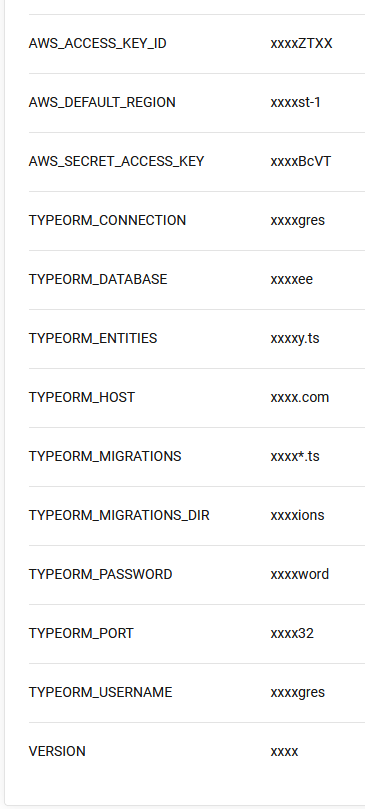

# Give your Application Auto-Deploy Superpowers

## Guides/Instructions

### The app

use Node 13.8.0.
I spent too much time to make it work with Node 16/18.
It's not worth it.

I also made several changes to the source code itself to be able to run build without errors (outside the ones udacity
gave, of course).

### infrastructure

1. Prometheus server

- choose an alerting solution.
  I chose [slack](https://grafana.com/blog/2020/02/25/step-by-step-guide-to-setting-up-prometheus-alertmanager-with-slack-pagerduty-and-gmail/).
- run [prometheus-server CloudFormation script](.circleci/files/prometheus-server.yml)

- install Prometheus and AlertManager

```bash
sudo apt update
# install any text editor
sudo apt install vim

# prometheus
wget https://github.com/prometheus/prometheus/releases/download/v2.43.0/prometheus-2.43.0.linux-amd64.tar.gz
tar vxf prometheus*.tar.gz

cd prometheus*/
# create prometheus config file
# see .circleci/ansible/roles/configure-prometheus-node-exporter/files/prometheus.yml for a quick solution
vim prometheus.yml
# start prometheus
prometheus --web.enable-lifecycle

# alertmanager
wget https://github.com/prometheus/alertmanager/releases/download/v0.25.0/alertmanager-0.25.0.linux-amd64.tar.gz
tar vxf alertmanager*.tar.gz
# .circleci/ansible/roles/configure-prometheus-node-exporter/files/alertmanager.yml
vim alertmanager.yml
# start alert manager
alertmanager &
```

2. Set up an RDS instance manually

3. create a bucket on `kvdb.io`

4. CircleCI enviroment

  - enviroment variables for the project to use `aws-cli` orbs and builds

  

  - SSH keys (the `.pem` file AWS gave you when you create key pair) to generate fingerprint.

And remember to suspend the Prometheus server and RDS after working since these things costs a lot (for me).

### pipeline

Make sure your CI-only workflow works first then work on the CD-only workflow.
Saved me a lot of build minutes (>10m for CD workflows).
When everything works, you can merge them.

```bash
# CD-only workflow circleci config.yml
...
workflows:
  default:
    jobs:
      - deploy-infrastructure:
      - configure-infrastructure:
          requires: [ deploy-infrastructure ]
      - run-migrations:
          requires: [ configure-infrastructure ]
      - deploy-frontend:
          requires: [ run-migrations ]
      - deploy-backend:
          requires: [ run-migrations ]
      - smoke-test:
          requires: [ deploy-backend, deploy-frontend ]
      - cloudfront-update:
          requires: [ smoke-test ]
      - cleanup:
          requires: [ cloudfront-update ]
```

### Retrospective

A lot of things doesn't work or just plain useless.
I'm sure you can improve them.

### License

[License](LICENSE.md)
